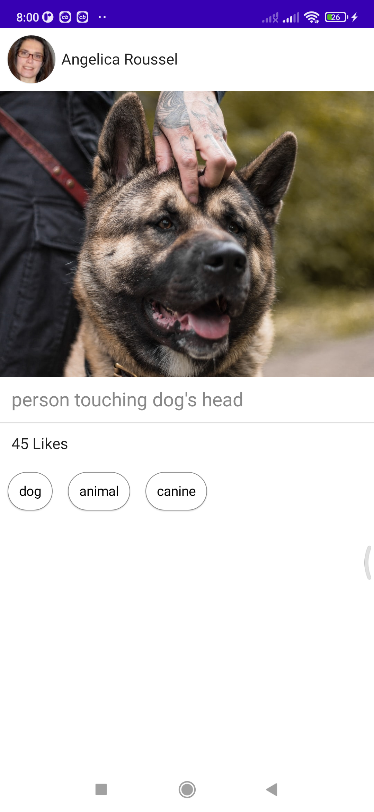
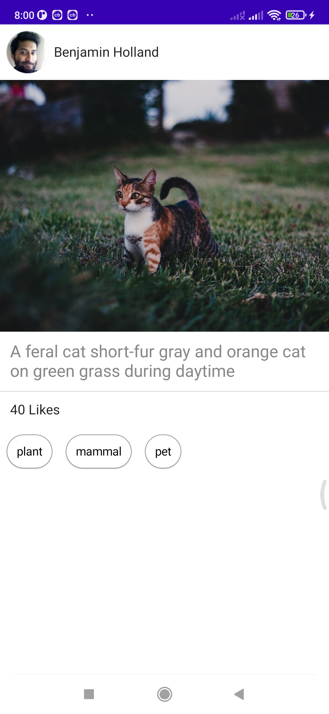

# Blog Application

Sample application to demonstrate Multi-module Clean MVVM Architecture and usage of Android Hilt,
Kotlin Flow, ConstraintLayout, Data-Binding, Navigation Graph etc.

## Overview

* Material Design & ConstraintLayout
* View Binding & Data binding
* Coroutines & Kotlin Flow
* Android Hilt - for Dependency Injection
* Multi module Clean MVVM Architecture (For smooth scalability)
* Unit testing - JUnit
* Retrofit - for Network Requests

## Screenshots

|  |   |  |  |
|:---:|:---:|:---:|:---:|:---:|:---:|

